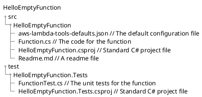

<!--
ignore these words in spell check for this file
// cSpell:ignore ambda runtimes typeof attributedefinitions keyschema provisionedthroughput Connor onfig ontext lient ccess policydocument evnt ateway
 -->

## .NET Workloads on AWS Lambda

[.NET Workloads on AWS Lambda](https://explore.skillbuilder.aws/learn/course/15308/.NET%2520Workloads%2520on%2520AWS%2520Lambda)

> In this course, you will learn how to use .NET with AWS Lambda. It includes step-by-step tutorials to create, deploy, run, test, and debug .NET Lambda functions using the command line, Visual Studio, Visual Studio Code, and Rider.

### Introduction

<details>
<summary>
Introduction to AWS Lambda
</summary>

> In this introductory lesson, you learn what serverless computing is, its benefits, and how it relates to Lambda.

comparing Traditional computing, cloud computing and serverless computing. the problems of having to manage on-premises data centers: buying, installing, configuring, security and management. cloud computing was the next step - having a virtual machine running in a public cloud provider data center, which removes some of the problems, and with enough investment in tweaking scaling schedules, can also handle unexpected loads (at the cost of extra complexity). the next step is serverless computing, which means that the cloud provider (AWS) handles the infrastructure and the user just provides the code.

- Fargate for container based applications
- Lambda for event driven applications

#### Lambda

Lambda are serverless compute that run your code in response to events from other AWS services:

- SNS - Simple Notification Service
- SQS - Simple Queue Service
- S3 - Simple Storage Service
- DynamoDB
- Api Gateway

Lambda triggers at milliseconds speed from the event, and are highly available, fault tolerant, and can run in multiple Availability Zones.

Rather than setting the machine (like EC2), a lambda requires configuring processor architecture and the amount of memory, and then AWS takes care of the rest. Lambda are also scalable by default, and the number of instances will change according to demand.

Lambda can run the same C# code as you normally write, without learning a new language. there are some templates to configure the starting code.\
Lambda create an **execution environment**, which runs the initialization code (constructors), and then the event handling code runs. this execution environment remains available for a while, and could be reused.

Pricing is based on the running time and the amount of memory allocated (not used) to the lambda. there are also extra charges if other AWS services are used as part of it.

#### Tutorial 1: .NET Tools for AWS Lambda

<details>
<summary>
IDE Extensions and CLI tools
</summary>
This Tutorial starts with installing development tools for the preferred IDE and with getting the AWS CLI tool.

for **visual studio**, we can install the _"AWS Toolkit"_ extension, which provides project templates to run work with aws services, and provides tools to test, deploy and manage those projects. we can use the _AWS Explorer_ to view our project and create sample code for testing them. this allows us to simulate code from different sources.\
**Visual Studio Code** has a subset of the features of visual studio, but can still be used to browse aws object, debug lambda and deploy them using the _AWS Explorer_.\
**Rider** also has the toolkit, and can be used in development.

The AWS CLI tools allows for a consistent scripting abilities to manage aws resource, it is available for windows, Linux and MacOS.

the AWS Toolkit has many template to get started with, we can install the lambda templates and view the options.

```sh
dotnet new -i "Amazon.Lambda.Templates::*"
dotnet new lambda --list
dotnet new lambda.EmptyFunction
```

some of the option start with "lambda" and some start with "serverless", the prior create the lambda project alone, while the later create the surrounding infrastructure, such as API gateway, databases and event sources.

we can list our lambda, invoke them, and deploy them (with a wizard), we can use the `--help` flag to get a list of available commands.

```sh
dotnet lambda list-functions
dotnet lambda invoke-functions <functionName>
dotnet lambda deploy-function
```

we can get "AWS Tools" for powershell, and do similar things like listing the lambdas and invoking them.

```ps
Get-Command -Module AWS.Tools.Lambda
Get-LMFunctionList
$Response=Invoke-LMFunction -FunctionName StringToUpperCase
-Payload '"hello world"'
[System.IO.StreamReader]::new($Response.Payload).ReadToEnd()
```

There is currently only limited support for dotNet 7, but there are some tools in alpha.

</details>

#### Tutorial 2: The "Hello World!" of Lambda functions

<details>
<summary>
Creating the basic AWS Lambda
</summary>

we create a lambda function project and name it "HelloLambda". we then navigate to the newly created code and deploy the lambda.

```sh
dotnet new lambda.EmptyFunction -n HelloLambda
cd HelloLambda/src/HelloLambda
dotnet lambda deploy-function --function-name HelloLambda
```

this starts a wizard, we can use an existing IAM role for the lambda or create a new one, if we create a new one we provide a name "HelloLambdaRole" and give it permissions ("AWSLambdaBasicExecutionRole").

once it's deployed, we can invoke it and then delete it (just the lambda, not the new IAM role).

```sh
dotnet lambda invoke-function --function-name HelloLambda --payload "Hello World!"
dotnet lambda delete-function --function-name HelloLambda
```

</details>

#### Tutorial 3: A .NET API Running in a Lambda Function

<details>
<summary>
Deploying lambda that Acts as a REST API with serverless configuration
</summary>

next we move on to deploying a lambda which will act as a REST API. we can use either the basic Minimal api or a complete Api. we also need an S3 bucket with a globally unique name. we navigate to the source code library and deploy the lambda and eventually delete it.

```sh
dotnet new serverless.AspNetCoreMinimalAPI -n HelloLambdaAPI
# or
dotnet new serverless.AspNetCoreWebAPI -n HelloLambdaAPI

aws s3api create-bucket --bucket your-unique-bucket-name1234
# or
aws s3api create-bucket --bucket your-unique-bucket-name1234
--create-bucket-configuration LocationConstraint=REGION

cd HelloLambdaAPI/src/HelloLambdaAPI
dotnet lambda deploy-serverless --stack-name HelloLambdaAPI --s3-bucket your-unique-bucket-name1234

dotnet lambda delete-serverless HelloLambdaAPI
```

</details>
</details>

### .Net on AWS Lambda

<details>
<summary>
Running A Lambda on AWS.
</summary>

Lambdas can be very simple (just returning a string) or very complex (full web applications with step functions).

#### Runtimes

<details>
<summary>
Determining how the code is executed
</summary>

not matter what kind of lambda, it needs a runtime. it can be a managed runtime, a custom runtime or a container image.

**Managed runtime** environments are the popular, off-the-shelf version of the runtime, provided by microsoft they work directly without hassle, only requiring the programmer to specify the runtime version in the _.csproj_ file of the dotnet project. AWS offers the current LTS (long term support) runtimes, for both x86_64 and arm64 architecture, running on Amazon Linux2.

**Custom runtimes** are an option if one wants to use a version which isn't supported by AWS, or if a precise custom runtime is needed. creating a custom runtime involves passing the `--self-contained=true` flag to the build command, or specifying it in the "aws-lambda-tools.defaults.json" file.\
a custom runtime requires us to pass the runtime itself and take care of managing it (patching, maintaining), and each lambda deployment requires all the files again. this makes the lambda larger and means they take longer to start.\
Common cases where custom runtimes are used is with languages which aren't popular or with preview versions languages which are still not production ready.

**Container Images** are an option to combine the code together with the runtime, and it's used by organization which are already using containers. this option allows for the most control, but since the image files are large (with an upper limit of 10GB) then it's also slower to start and update.

</details>

### AWS SDK Package

the aws sdk package is broken into smaller pieces, such as a package for S3, for Lambda, for DynamoDb, etc... even the lambda library has different package for different event types (S3, Kinesis, SNS, SQS).

for some cases we don't even need the package, like RDS SQL, where we can use the entity framework instead.\
In general, we should always use the least privileged option we have, and never give an IAM role more permissions than it must have to complete its' goals.

#### Invoking a Lambda

<details>
<summary>
The input to a Lambda invocation
</summary>

Lambdas can be invoked with a string payload, a json object, http request or with an event, or even with a stream.

A lambda function has a single function handler, this is the entry-point for the lambda, it takes the event and an optional ILambdaContext object with information about the current invocation.

the format of the .Net lambda function handler is `AssemblyName::Namespace::ClassName::MethodName`.

everything that triggers a lambda eventually becomes json and are serialized into events of different types. we use the Function handler method signature to define the type of event the we want to serialize the json into. this can be an AWS event type of something which we created ourselves.

The code that has the lambda handler needs a specific attribute, for "lambda" templates, it's
`[assembly: LambdaSerializer(typeof(Amazon.Lambda.Serialization.SystemTextJson.DefaultLambdaJsonSerializer))]`, for "serverless" templates, the handler is defined in the "serverless.template" file, and it can inherit from different base classes to fit different types of events

- API gateway REST API
- API gateway HTTP payload version 1.0
- API gateway HTTP payload version 2.0
- Application Load balancer

when we send an HTTP request, it's not handled by the lambda directly, it's first handled by the gateway of the load balancer, which forwards it to the lambda itself.

</details>

#### Concurrency

<details>
<summary>
Reserved and Provisioned Concurrency
</summary>

There is default limit on the number of concurrent Lambda executions. this limit is for all the lambdas in the account.

a Lambda can have a **Reserved Concurrency**, which means that it has a guaranteed number of concurrent executions from the account total, this also takes away from the pool of available executions for other lambdas.

A Lambda can also belong to a lambda execution runtime, which is done via the **Provisioned Concurrency**. this has additional costs, but makes responding to events much quicker by avoiding cold starts.

</details>

#### Cold Starts and Warm Starts

<details>
<summary>
Lambda Start up overhead
</summary>

when a lambda is executed, the code for it is taken from an S3 bucket (or a Elastic Container Registry for container images), aws handles compiling and running the file (including the initialization code in the constructor) and then the function handler is called. this time is referred to as "cold start".

if a function is invoked regularly, then it will not experience cold starts, since it will still remain active since last execution. this is a "warm start", and is much faster. if we wish to keep an execution environment active, we can ping it frequently.

when a function is not invoked regularly (or when it's updated), then it experiences a "cold start", which is slower. if we have a function that isn't active but we still wish to avoid this case, we can keep it in a Provisioned Concurrency environment of it's own. the amount of time spent in a "cold start" differs based on the runtime, with managed runtimes being the fastest, custom runtime being slower, and container images runtime even slower.

.Net 7 has native ahead-of-time compilation, which has faster cold start. we can take advantage of this with the new "NativeAOT" templates. custom runtimes before .NET7 also have the "publish trimmed" and "publish ready to run" options which can reduce the size of the package (by trimming unused packages) or run ahead-of-time compilation (which increases the package size). those options are set in the ".csproj" file.

```xml
<PublishTrimmed>true</PublishTrimmed>
<PublishReadyToRun>true</PublishReadyToRun>
```

</details>

#### Tutorial 4: A Hello World Style .NET Lambda function

<details>
<summary>
More in-depth walkthrough of creating a Lambda
</summary>

we create the default hello world empty Lambda function again, but this time we'll look more into what happens.

```sh
dotnet new -i Amazon.Lambda.Templates
dotnet tool install -g Amazon.Lambda.Tools

dotnet new lambda.EmptyFunction -n HelloEmptyFunction
cd HelloEmptyFunction/src/HelloEmptyFunction
dotnet lambda deploy-function HelloEmptyFunction

dotnet lambda invoke-function HelloEmptyFunction --payload "Invoking a Lambda function"

dotnet lambda delete-function HelloEmptyFunction
```

when we create the project, the following files are created:



two folders, one for the source code and one for testing. in the source code folder "src", we can look at the "Function.cs" file and see the special attribute for json serializing and the function handler method taking string input and the ILambdaContext object. the function handler itself can be synchronous or asynchronous, like any other method.

the "aws-lambda-tools-defaults.json" file contains option for how the function is deployed, including the aws profile used, the runtime, memory, timeout and the function-handler in the full format.

the solution also has a basic test project with the XUnit framework that tests the function handler really returns a transformed string into uppercase.

when we run the deploy command, we can see the output with the values from the defaults file, and if we create an IAM role, we will also see what happens there. when we invoke the lambda, we see the log trail with additional data about memory, duration and memory usage. we can modify the function code and use `context.Logger.LogInformation()` to add logs and see them in the log trail after deploying and invoking again.

we can also do the same from the AWS web management console in the browser.

</details>

#### Tutorial 5: A .NET Lambda Function that Takes a JSON Payload

<details>
<summary>
Taking a json payload in the lambda
</summary>

Aws Lambda usually consume events, but they actually consume json objects, which are serialized into the events. we can crate our own object and take it as our input.

```sh
dotnet new lambda.EmptyFunction -n HelloPersonFunction
dotnet lambda delete-function HelloPersonFunction
```

in this new lambda, we add a new class of type "person" and modify the handler to accept objects from this class.

```csharp
public class Person
{
  public string FirstName { get; init; }
  public string LastName { get; init; }
}

public string FunctionHandler(Person input, ILambdaContext context)
{
  return $"Hello, {input.FirstName} {input.LastName}";
}
```

we deploy the lambda as we did before and invoke it with a json payload (the formatting changes based on the terminal we use)

```sh
dotnet lambda deploy-function HelloPersonFunction
dotnet lambda invoke-function HelloPersonFunction --payload '{
\"FirstName\": \"Alan\", \"LastName\": \"Adams\" }'
```

we should see the response from the lambda with the data we provided in the payload.

</details>

#### Tutorial 6: Creating and running a Web API Application as a Lambda Function

<details>
<summary>
A Lambda that responds to HTTP requests
</summary>
we now create a serverless lambda that responds to HTTP requests. this will require a API gateway to forward the requests to us. when we run this locally from visual studio, the template creates a Kestrel web server for us to experiment with.

```sh
dotnet new serverless.AspNetCoreWebAPI -n
HelloAspNetCoreWebAPI
```

just like before, when we create the lambda solution, it creates a "src" and "test" folders. this time with much more files. we also get an apiGatewayProxyRequest in the unit test project.

before we can deploy a serverless lambda, we need an S3 bucket to store the CloudFormation stack into. then we can deploy into it (providing answers to the wizard). this also creates and runs the cloud formation stack with the needed resources. when it's completed we will get the public URL to use to invoke the API.

```sh
aws s3api create-bucket --bucket your-unique-bucket-name1234
dotnet lambda deploy-serverless
dotnet lambda delete-serverless AspNetCoreWebAPI
```

if we navigate to the URL, it invokes the `GET` request on that resource. the api gateway has a timeout of 30 seconds, regardless of how the lambda timeout was defined.

we can see the information in aws web console under <kbd>Lambda</kbd>, <kbd>Applications</kbd> and we then see it's connected to a bunch of resources.

if the lambda is simple enough, then it can be better to use _AWS Lambda Function URL_, which are HTTPs endpoints by themselves which are mapped to single function microservices.

</details>

</details>

### Working With other AWS Services

<details>
<summary>
Connecting the lambda to other services.
</summary>
Having A Lambda function interact with other AWS services.

##### Access AWS RDS database Servers From a Lambda Function
If we have a database hosted somewhere on the web or in a data center, accessing it from the lambda is no different then accessing them from the local machine. All that we need is to have a connection string and the password.

if the database is not publicly accessible (hosted on the cloud) then we might need to connect the lambda to the VPC which holds the database.

##### Access AWS Services From a Lambda Function
If our Lambda needs to interact with other AWS services (S3, DynamoDB, Kinesis), then we need to use AWS SDKs to interact with them in the code,  and we need our lambda to use an IAM role with appropriate permissions.

##### Allow Other Services To Invoke Lambda Functions
If we want **Other** services to trigger the lambda (such as when an item is added to the S3 bucket), then we need to define a resource based policy and allow them permissions to the lambda.

#### Tutorial 7: Accessing AWS Services from a Lambda Function

<details>
<summary>
Accessing A DynamoDB table from the lambda.
</summary>

we will create a DynamoDB table and a Lambda to interact with it. Permissions in AWS are managed by policies. we can have an inlined policy attached directly to the role, or have a stand-alone reusable policy that we can attach to roles as needed. When granting permissions, we should keep the scope of actions to the minimum required. in this case, we need the "dynamodb:GetItem" and "dynamodb:DescribeTable" permissions.

we first create the dynamoDB table with a powershell command. the table is called "People". we then populate it with some elements

```sh
# create table
aws dynamodb create-table --table-name People --attributedefinitions AttributeName=PersonId,AttributeType=N --keyschema AttributeName=PersonId,KeyType=HASH --provisionedthroughput ReadCapacityUnits=1,WriteCapacityUnits=1

# add items
aws dynamodb put-item --table-name People --item
'{\"PersonId\":{\"N\":\"1\"},\"State\":{\"S\":\"MA\"},
\"FirstName\": {\"S\":\"Alice\"}, \"LastName\":
{\"S\":\"Andrews\"}}'
aws dynamodb put-item --table-name People --item
'{\"PersonId\":{\"N\":\"2\"},\"State\":{\"S\":\"MA\"},
\"FirstName\": {\"S\":\"Ben\"}, \"LastName\":
{\"S\":\"Bradley\"}}'
aws dynamodb put-item --table-name People --item
'{\"PersonId\":{\"N\":\"3\"},\"State\":{\"S\":\"MA\"},
\"FirstName\": {\"S\":\"Claire\"}, \"LastName\":
{\"S\":\"Connor\"}}'
```

next we create the code for the lambda function in C#.
```sh
dotnet new lambda.EmptyFunction -n LambdaFunctionDynamoDB 
cd LambdaFunctionDynamoDB /src/LambdaFunctionDynamoDB
dotnet add package AWSSDK.DynamoDBv2
```
we replace the starting code with the following code. it uses the modern style of top level namespace. the function handler creates a client to connect with dynamoDB table and reads one value from the table, it then returns a string from the value. the "Person" class is the type of objects in the DynamoDB table, with the PersonId being the HashKey.

```csharp
using Amazon.DynamoDBv2;
using Amazon.DynamoDBv2.DataModel;
using Amazon.Lambda.Core;

[assembly: LambdaSerializer(typeof(Amazon.Lambda.Serialization.SystemTextJson.DefaultLambdaJsonSerializer))]
namespace LambdaFunctionDynamoDB;

public class Function
{
  public async Task<string> FunctionHandler(ILambdaContext lambdaContext)
  {
    AmazonDynamoDBConfig clientConfig = new AmazonDynamoDBConfig();
    AmazonDynamoDBClient client = new AmazonDynamoDBClient(clientConfig);
    DynamoDBContext dynamoDbContext = new DynamoDBContext(client);

    Person person = await dynamoDbContext.LoadAsync<Person>(1);

    return $"{person.FirstName} {person.LastName} lives in {person.State}";
  }
}

[DynamoDBTable("People")]
public class Person
{
  [DynamoDBHashKey]
  public int PersonId {get; set;}
  public string State {get; set;}
  public string FirstName {get; set;}
  public string LastName {get; set;}
}
```

next, we deploy the lambda and create the IAM Role, for now we won't give it appropriate permissions so we could see the error message when we invoke it.
```sh
dotnet lambda deploy-function LambdaFunctionDynamoDB
dotnet lambda invoke-function LambdaFunctionDynamoDB 
```
we get an error about missing permissions, so we need the policy. we create a new file "DynamoDBAccessPolicy.json" in the "/src/LambdaFunctionDynamoDB" folder. in the *Resource* section we need to fix the arn to be that of our DynamoDB table.

```json
{
"Version": "2012-10-17",
  "Statement": [
    {
      "Effect": "Allow",
      "Action": [
        "dynamodb:DescribeTable",
        "dynamodb:GetItem" 
      ],
      "Resource": "arn:aws:dynamodb:us-east-1:YOUR_ACCOUNT_NUMBER:table/people"
    }
  ]
}
```
we now update the role with this inline policy. we deploy again and invoke it.
```sh
aws iam put-role-policy --role-name LambdaFunctionDynamoDB
Role --policy-name LambdaFunctionDynamoDB Access --policydocument file://DynamoDBAccessPolicy.json

dotnet lambda deploy-function LambdaFunctionDynamoDB 
dotnet lambda invoke-function LambdaFunctionDynamoDB
dotnet lambda delete-function LambdaFunctionDynamoDB
```

this will now work! and we will receive the correct response from the lambda. we Won't need to attach the policy to the role until we delete it, change the table arn or if we need more permissions.

some methods in the SDKs of services specify which permissions are needed for them as part of the methods metadata (intellisense).
</details>

#### Tutorial 8: Allowing Other Services to Invoke Lambda Functions

<details>
<summary>
Triggering The Lambda Through a Different AWS Service.
</summary>
In this Tutorial, Our lambda Function will be invoked by the S3 service. it will also use the serverless lambda templates with an API gateway. the API gateway should have permissions to invoke the lambda.

we start by creating the s3 bucket in the "us-east-1" region

```sh
aws s3api create-bucket --bucket my-unique-bucket-name-lambdaCourse --create-bucket-configuration LocationConstraint=us-east-1
```
next we create the lambda code, we use the S3 event handler template

```sh
dotnet new lambda.S3 -n S3EventHandler
cd S3EventHandler/src/S3EventHandler
```
we replace the code in the "function.cs" file. the code takes an S3 event, if it's not a deletion event, it pulls the object metadata and prints the type of the object. for deletions, it just prints which object was deleted. 

```csharp
public async Task FunctionHandler(S3Event evnt, ILambdaContext context)
{
  context.Logger.LogInformation($"A S3 event has been received, it contains {evnt.Records.Count} records.");
  foreach (var s3Event in evnt.Records)
  {
    context.Logger.LogInformation($"Action: {s3Event.
    EventName}, Bucket: {s3Event.S3.Bucket.Name}, Key: {s3Event.
    S3.Object.Key}");
    if (!s3Event.EventName.Value.Contains("Delete"))
    {
      try
      {
        var response = await this.S3Client.
        GetObjectMetadataAsync(s3Event.S3.Bucket.Name, s3Event.
        S3.Object.Key);
        context.Logger.LogInformation( $"The file type is {response.Headers.ContentType}");
      }
      catch (Exception e)
      {
        context.Logger.LogError(e.Message);
        context.Logger.LogError($"An exception occurred while retrieving {s3Event.S3.Bucket.Name}/{s3Event.S3.Object.Key}. Exception - ({e.Message})");
      }
    }
    else
    {
      context.Logger.LogInformation($"You deleted {s3Event.S3.Bucket.Name}/{s3Event.S3.Object.Key}");
    }
  }
}
```

we deploy the lambda, create the role for it and add the permissions to access the S3 bucket. like before, we create a file with policy. this policy allows the "GetObject" on all objects in the specified bucket.

```json
{
 "Version": "2012-10-17",
 "Statement": [
    {
      "Effect": "Allow",
      "Action": [
        "s3:GetObject"
      ],
      "Resource": "arn:aws:s3:::my-unique-bucket-nameLambda-course/*"
    }
  ]
}
```

this time, we create the policy outside the role, so we first create the policy, and then attach the policy to the role.

```sh
dotnet lambda deploy-function S3EventHandler

aws iam create-policy --policy-name S3AccessPolicyForCourseBucket --policy-document file://S3AccessPolicyForCourseBucket.json

aws iam attach-role-policy --role-name S3EventHandlerRole --policy-arn arn:aws:iam::<ACCOUNT_NUMBER>:policy/S3AccessPolicyForCourseBucket
```

we could also attach the policies through the web console. in the lambda function page, under the <kbd>Configuration</kbd> tab, we can choose the execution role, and the click <kbd>Add permissions</kbd>and <kbd>Attach policies</kbd>. here we can either attach an existing policy or choose to <kbd>Create Policy</kbd> directly. In the wizard we select *S3* as the service, *GetObject* as the action, and enter the *ARN of the bucket* as the Resource, we allow access to any object in the bucket with the wildcard `*` symbol for the Object Name. we then create the policy and attach it to the lambda.

next we need to set the S3 bucket to call the lambda. in the bucket <kbd>Properties</kbd> tab we click <kbd>Create event notification</kbd>. in the wizard, we give the event a name, and select the checkboxes for "all object create events" and "all object removal events". we don't need a filter for the object name. for the Destination option, we choose *Lambda function* and select the lambda which we created.

we can navigate back to the lambda page, under <kbd>Configuration</kbd> tab and <kbd>Permissions</kbd> we can look at the resource-based policies and see that the policy allows the S3 bucket to trigger the lambda.

To test the behavior, we will put an object in the bucket and then delete it, we will then look at the lambda logs to see the text printed from our code. if we have the AWS extension for the IDE, we could also read the logs from there.

```sh
aws s3api put-object --bucket my-unique-bucket-name-lambdaCourse --key Hello.txt --body Hello.txt --content-type "text/plain"
aws s3api delete-object --bucket my-unique-bucket-name-lambdaCourse --key Hello.txt
```

we then delete the lambda (and the bucket)
```sh
dotnet lambda delete-function LambdaFunctionDynamoDB
```
</details>

</details>

### Testing And Debugging Lambda Functions

<details>
<summary>
Ways To Test and Debug Lambda Functions
</summary>

#### Local Testing

<details>
<summary>
Ways to test code locally.
</summary>

The easiest way to test the code is by writing **Unit Tests** and run them  in the project. There is also the option of using the **AWS .Net Mock Lambda Test Tool** which is available as part of the *AWS SDK*. Containers can be tested with the **Runtime Interface Emulator**.

There are tools such as *LocalStack* which help with testing lambda locally, but the best way is to deploy the lambda and test them on the cloud.

</details>


#### Tutorial 9: Testing with the xUnit Test Project Template

<details>
<summary>
Running the Projects' unit tests.
</summary>
When we create a .Net Lambda Function solution, it also creates a unit test project for us. we can either run the test from the command line or from the IDE.

```sh
dotnet new lambda.EmptyFunction -n FunctionWithTestProject
cd FunctionWithTestProject/test/FunctionWithTestProject.Tests
dotnet test
```

our unit tests should target the code we write, and we can use mocking libraries like any other project. 

</details>

#### Tutorial 10: Testing with the AWS .NET Mock Lambda Test Tool

<details>
<summary>
Sending Payloads to the lambda
</summary>

The tool allows to define payloads to the lambda and run it. it also supports a Web UI mode.

we first install (or update) the tool, then we can navigate to the folder we with the function in it and run the tool in a command line mode.

```sh
dotnet tool install -g Amazon.Lambda.TestTool-6.0
dotnet tool update -g Amazon.Lambda.TestTool-6.0
dotnet lambda-test-tool-6.0 --no-ui --payload '\"hello\"'
```
if we drop the "no-ui" flag, then we launch the browser with an interface to define our workload and and choose from examples (such as simulating events from other services).
</details>

#### Tutorial 11: Containers and the Runtime Interface Emulator

<details>
<summary>
Testing Of Containerized Workloads
</summary>

The Runtime Interface Emulator allows us to test functions running in containers.
we first create a container based project

```sh
dotnet new serverless.image.EmptyServerless --name TestingFunctionWithRIE
```
we open the "Function.cs" file and replace the `GET` method

```csharp
public APIGatewayProxyResponse Get(APIGatewayProxyRequest request,  ILambdaContext context)
{
  context.Logger.LogInformation($"Get method invoked. You requested {request.PathParameters['Id']}");
  var response = new APIGatewayProxyResponse
  {
    StatusCode = (int)HttpStatusCode.OK,
    Body = $"You were looking for something with an Id of : {request.
    PathParameters['Id']}",
    Headers = new Dictionary<string, string> {
      { "Content-Type","application/json"}
    }
  };

  return response;
}
```
now we build the project, the image and then run it in docker.

```sh
cd TestingFunctionWithRIE/src/TestingFunctionWithRIE 
dotnet build -c Release -o .\bin\Release\lambda-publish\ 
docker build -t testing_function_with_rie:latest
docker run -it -p 9000:8080 testing_function_with_rie:latest
TestingFunctionWithRIE::TestingFunctionWithRIE.Functions::Get
```

we can send it request with any REST client we like, such a Postman or the built-in rest clients.
</details>


</details>

### Takeaways

<details>
<summary>
Things worth remembering
</summary>

SAM - Serverless Application Model

dotnet tools

```sh
dotnet tool install -g Amazon.Lambda.Tools
dotnet tool update -g Amazon.Lambda.Tools
dotnet lambda
dotnet lambda --help
dotnet new -i Amazon.Lambda.Templates
dotnet new lambda --list
dotnet new lambda.EmptyFunction
dotnet new serverless.AspNetCoreMinimalAPI -n <function name>
dotnet new serverless.AspNetCoreWebAPI -n <function name>
dotnet lambda list-functions
dotnet lambda deploy-function
dotnet lambda deploy-serverless --stack-name <stack name> --s3-bucket <S3 bucket name>
dotnet lambda invoke-function --function-name <function name> --payload <payload>
dotnet lambda delete-function --function-name <function name>
dotnet lambda delete-serverless --function-name <function name>
```

#### AWS CLI

```sh
aws --version
aws s3api create-bucket --bucket <bucket-name>
aws s3api create-bucket --bucket <bucket-name> --create-bucket-configuration LocationConstraint=<bucket base region>
aws s3api put-object --bucket <bucket-name>  --key <object key> --body <object body> --content-type "text/plain"
aws s3api delete-object --bucket <bucket-name> --key <object key>

aws cloudformation describe-stack-resources -stack-name <stack name>
aws cloudformation describe-stack-resources -stack-name <stack name> --query
'StackResources[].[{ResourceType:ResourceType,
LogicalResourceId:LogicalResourceId,
PhysicalResourceId:PhysicalResourceId}]'

aws dynamodb create-table --table-name <table name> --attributedefinitions AttributeName=<required attribute name> ,AttributeType=<required attribute type> --keyschema AttributeName=<key name>,KeyType=<key type> --provisionedthroughput ReadCapacityUnits=1,WriteCapacityUnits=1
aws dynamodb put-item --table-name <table name> --item
'{\"Key\":{\"N\":\"1\"},\"otherField\":{\"S\":\"Other Value\"}}'

aws iam put-role-policy --role-name <role name>
Role --policy-name <policy name> Access --policydocument <file path>
```

</details>
